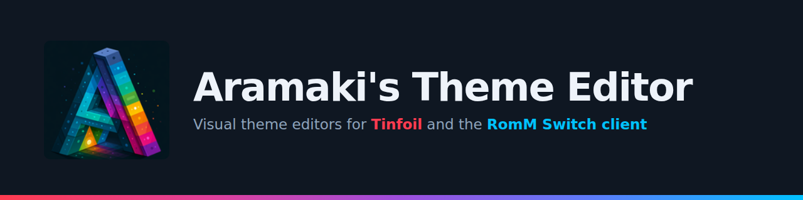

<div align="center">



### A visual, in-browser editor for Tinfoil `theme.json` files
No installs. No command line. Just open it and drag in a theme.

[](https://github.com/Huntereb/Tinfoil)
[](#-quick-start)
[](#-desktop-app)
[](#-license)

[Quick Start](#-quick-start) •
[Features](#-features) •
[How to Use](#-how-to-use) •
[Supported Format](#-supported-theme-format) •
[Desktop App](#-desktop-app) •
[FAQ](#-faq)

</div>

---

## 🧾 What is this?

**Aramaki's Tinfoil Theme Editor** is a single self-contained web app for creating and editing [Tinfoil](https://github.com/Huntereb/Tinfoil) `theme.json` files — no more hand-editing raw JSON and guessing what a color or path field does. Load your theme, see and tweak every field through a proper UI, preview it live, and export it back out.

It was built alongside the [A-Theme Tinfoil theme collection](https://github.com/A-Theme/Tinfoil-Themes) to make creating and tweaking themes actually pleasant.

Everything runs **entirely in your browser (or as a standalone desktop app)** — no server, no account, no upload. Your theme file never leaves your machine.

---

## ✨ Features

- **🗂️ Auto-generated editor** — drop in any `theme.json` and get a full form built from its actual structure: nested objects become collapsible sections, arrays get add/remove controls, no schema hardcoding required.
- **🎨 Smart color fields** — automatically detects hex colors in *any* format Tinfoil themes use (`#rrggbb`, bare `rrggbbaa`, with or without alpha) and gives you a real color picker next to the raw value, always writing back in the exact original style.
- **🖼️ Live 16:9 preview** — a pixel-accurate mockup of the actual Tinfoil layout (grid, selection highlight, scrollbar, progress bar, context menu) built from your theme's real values, with a generic fallback preview for non-standard schemas.
- **🏷️ Logo preview panel** — see your logo at true size with real pixel dimensions, including themes that point at dynamic `.php` endpoints instead of static image files.
- **🎵 Music/audio tester** — play back any audio field directly in the browser, with a local-file fallback for `sdmc:/`-style paths a browser can't fetch on its own.
- **🌈 Palette generator** — 10 color scheme types (monochromatic, analogous, complementary, split-complementary, triadic, tetradic, pastel, vibrant/neon, shades, random) to help design a cohesive theme from a single seed color.
- **🖌️ Extract palette from your background image** — real dominant-color clustering (k-means, not just averaging) pulls a ready-to-use palette straight out of your background art.
- **🧩 One-click palette apply** — map generated or extracted colors onto any field in your theme with a single click, with smart auto-suggestions based on each field's role.
- **📝 Raw JSON view** — for when you just want to paste or hand-edit directly.
- **⬇️ Export anywhere** — download your edited theme as a ready-to-use `theme.json`.

---

## 🚀 Quick Start

1. **[Download `tinfoil-theme-editor.html`](#)** from this repo (or grab the [Windows desktop app](#-desktop-app) if you'd rather not use a browser).
2. Open the file in any modern browser (Chrome, Edge, or Firefox — just double-click it).
3. Drag your `theme.json` onto the page, or use **Open theme.json**.
4. Edit anything using the generated form — colors, image paths, numbers, toggles, all of it.
5. Hit **Download** to export your changes.

No build step. No dependencies. No install. It's one HTML file.

---

## 📖 How to Use

### Loading a theme
You can get your `theme.json` into the editor three ways:
- **Drag and drop** the file onto the page
- Click **📂 Open theme.json** and pick it from a file dialog
- **Paste raw JSON** directly into the text box on the start screen

### Editing fields
Every field in your theme gets an appropriate control automatically:

| Field type | What you get |
|---|---|
| Hex color (any format) | Color picker + editable text, synced both ways |
| Image path | Thumbnail preview |
| Audio path | Tagged and testable in the Music panel |
| Number | Numeric input |
| Boolean | Checkbox |
| Nested object | Collapsible section |
| Array | List with add/remove controls |

Use the **filter box** in the sidebar to jump straight to a specific field in large files.

### Previewing
The **live preview** at the top updates as you type, rendering an approximation of the actual Tinfoil shop screen — background, icon grid, selection highlight, scrollbar, and progress bar — all driven by your current values.

### Building a color palette
1. Pick a seed color (or click **🎲 Random seed**).
2. Choose a scheme from the dropdown.
3. Click **Generate palette**.
4. For each color field in your theme, assign a palette slot (or leave it as **Keep original**).
5. Click **Apply palette to theme**.

You can also click **🎨 Extract palette from background** to pull a palette directly out of your theme's background image instead of starting from a seed color.

### Exporting
Click **⬇ Download** at any time to save your edited `theme.json`. Use **↺ Reset** to discard changes and start over from the originally loaded file.

---

## 🧬 Supported Theme Format

This editor targets Tinfoil's `theme.json` schema, structured like:

```json
{
  "color": "f0faf2d9",
  "logo": "sdmc:/switch/tinfoil/themes/YourTheme/logo.png",
  "background": {
    "color": "d0a993d9",
    "image": "https://example.com/background.jpg"
  },
  "selection": {
    "color": "f0faf2d9",
    "background": { "color": "f0faf28c" },
    "border": { "color": "07700ad9", "width": 0.5 }
  },
  "menu": {
    "selection": { "...": "..." },
    "background": { "color": "07700acc" }
  },
  "border": { "color": "07700ad9", "width": 0.5 },
  "progressBar": { "color": "191f1ad9", "background": { "color": "9a6843cc" }, "width": 0.5 },
  "scrollBar":   { "color": "9a6843d9", "background": { "color": "191f1acc" }, "width": 0.5 },
  "icons": {
    "small":  { "margin": 6, "width": 136 },
    "medium": { "margin": 6, "width": 184 }
  },
  "music": {
    "url": "sdmc:/switch/tinfoil/themes/YourTheme/shop-theme.mp3",
    "volume": 5
  }
}
```

> Colors are 6 or 8-digit hex (`RRGGBB` or `RRGGBBAA`), usually **without** a leading `#`. The editor detects and preserves whichever style your file already uses.

The editor isn't hardcoded to this exact shape — if it detects a different structure, it falls back to a generic field-by-field editor and a best-guess preview, so it's still usable for related or modified schemas.

---

## 💻 Desktop App

Prefer not to open a browser? A packaged Windows desktop version is available on the [**Releases**](../../releases/latest) page — same app, wrapped in its own window with a taskbar icon, no browser required.

**[⬇ Download the latest Windows build](../../releases/latest)**

> **Note:** it ships as a folder, not a single `.exe` — that's normal for Electron-based apps, which bundle a full runtime alongside the executable. Unzip the whole folder and run the `.exe` from inside it.

---

## ❓ FAQ

**Does this upload my theme file anywhere?**
No. Everything happens locally in your browser using JavaScript — nothing is sent to a server.

**Can I use this for themes that don't quite follow the standard schema?**
Yes — the field editor works on arbitrary JSON structures. The live preview is most accurate for the standard schema shown above, but falls back gracefully otherwise.

**Why can't I see my logo or hear my music preview?**
If your `theme.json` points to an `sdmc:/` path, that's a Nintendo Switch SD card path a browser can't reach. Use the **Browse local file** option in the Logo or Music panel to preview the actual file from your computer instead.

**Where can I find more Tinfoil themes?**
Check out [A-Theme/Tinfoil-Themes](https://github.com/A-Theme/Tinfoil-Themes) for a large collection of ready-made themes, or join the Discord linked there for requests.

---

## 📜 License

MIT — do whatever you'd like with it.

---

<div align="center">

Made by **Aramaki** · part of the [A-Theme](https://github.com/A-Theme) project

</div>
